# Symphony (sym)

GitHub Repository Role & Policy Management Tool with Code Convention Validation

Symphony는 GitHub OAuth 인증을 통한 역할 기반 파일 접근 권한 및 코딩 정책 관리를 위한 하이브리드 CLI/Web 애플리케이션입니다. 자연어로 정의된 컨벤션을 검증하는 LLM 친화적 linter 기능을 포함합니다.
[](https://devsymphony.github.io/sym-cli/coverage.html)

## 개요

> **빠른 시작:** `sym login` 한 번이면 끝! OAuth App 설정 불필요.

## 주요 기능

### 역할 및 권한 관리
- **CLI 인터페이스**: 사용자 역할 및 리포지토리 정보 빠른 조회
- **웹 대시보드**: 권한 관리를 위한 시각적 인터페이스 (포트 8787)
- **OAuth 인증**: 안전한 GitHub/GHES 인증
- **동적 역할 시스템**: 커스텀 역할 생성 및 관리
- **JSON API**: 스크립팅을 위한 기계 판독 가능 출력

### 정책 편집기 (Policy Editor)
- **RBAC (Role-Based Access Control)**: 역할별 파일 접근 권한 및 시스템 권한 설정
- **코딩 규칙 관리**: 프로젝트별 코딩 컨벤션 및 정책 정의
- **템플릿 시스템**: React, Vue, Node.js, Python, Go, TypeScript 템플릿 제공
- **히스토리 추적**: 정책 변경 이력 조회 (Git 기반)
- **자동 저장**: 30초마다 자동 저장 (선택 가능)
- **안전장치**: 최소 1명의 정책 편집자 보장, 역할 삭제 보호
- **권한 기반 UI**: 권한에 따른 읽기 전용 모드 자동 적용
- 자연어 기반 컨벤션 정의
- **LLM 기반 자동 변환**: OpenAI API로 자연어 규칙을 linter 설정으로 자동 변환
- **다중 Linter 지원**: ESLint, Checkstyle, PMD 등 여러 linter 설정 파일 동시 생성
- 코드 스타일 및 아키텍처 규칙 검증
- RBAC 기반 파일 접근 제어
- JSON 출력을 통한 LLM 도구 연동
- 컨텍스트 기반 컨벤션 추출

### 코드 컨벤션 검증 (개발 중)
- **자연어 기반 컨벤션 정의**: `.sym/user-policy.json`에 자연어로 규칙 작성
- **스키마 변환**: A 스키마 (사용자 입력) → B 스키마 (검증 엔진용)
- **다중 검증 엔진**: Pattern, Length, Style, AST 엔진 지원
- **LLM 도구 연동**: JSON 출력을 통한 AI 코딩 도구 연동
- **컨텍스트 기반 추출**: 작업 컨텍스트에 맞는 컨벤션만 추출

### 기술 스택
- **단일 바이너리**: 런타임 의존성 불필요
- **임베디드 에셋**: go:embed를 통한 정적 파일 내장 (HTML, CSS, JS, SVG)
- **프로덕션 CSS**: Tailwind CSS 빌드 시스템
- **멀티플랫폼**: Windows, macOS (Intel/ARM), Linux (AMD64/ARM64) 지원
- **UTF-8 지원**: 한글 및 이모티콘 완벽 지원

## 설치

### MCP 서버로 설치 (권장 - AI 코딩 도구)

**Claude Code 원클릭 설치**:
```bash
claude mcp add symphony npx @dev-symphony/sym@latest mcp
```

**수동 MCP 설정** (Claude Desktop / Cursor / Continue.dev):

config 파일 위치:
- macOS: `~/Library/Application Support/Claude/claude_desktop_config.json`
- Windows: `%APPDATA%/Claude/claude_desktop_config.json`
- Linux: `~/.config/Claude/claude_desktop_config.json`

설정 추가:
```json
{
  "mcpServers": {
    "symphony": {
      "command": "npx",
      "args": ["-y", "@dev-symphony/sym@latest", "mcp"],
      "env": {
        "SYM_POLICY_PATH": "${workspaceFolder}/.sym/user-policy.json"
      }
    }
  }
}
```

Claude Desktop 재시작 후 사용 가능!

### npm 글로벌 설치

```bash
npm install -g @dev-symphony/sym
```

### 바이너리 다운로드

GitHub Releases 페이지에서 플랫폼에 맞는 바이너리를 다운로드할 수 있습니다.

#### GPG 서명 검증 (권장)

릴리스 바이너리는 GPG로 서명됩니다. 다운로드한 파일의 무결성을 검증하려면:

```bash
# 1. GPG 공개키 가져오기 (최초 1회)
gpg --keyserver keys.openpgp.org --recv-keys [GPG_KEY_ID]

# 2. 서명 검증
gpg --verify sym-linux-amd64.asc sym-linux-amd64
```

서명이 유효하면 `Good signature from "DevSymphony"` 메시지가 표시됩니다.

### 소스에서 빌드

```bash
# 리포지토리 클론
git clone https://github.com/DevSymphony/sym-cli.git
cd sym-cli

# 의존성 설치 및 빌드
make setup
make build

# Windows의 경우 bin/sym.exe 생성됨
# Unix 계열의 경우 bin/sym 생성됨
```

### 시스템에 설치

```bash
# GOPATH/bin에 설치
make install

# 또는 직접 설치
go install github.com/DevSymphony/sym-cli/cmd/sym@latest
```

### PATH 설정 (Windows)

```powershell
# 사용자 환경변수에 추가
[System.Environment]::SetEnvironmentVariable('Path', $env:Path + ';D:\Git\sym-cli\bin', 'User')
```

## 빠른 시작

### MCP 서버 모드 (AI 코딩 도구와 함께)

Symphony를 MCP 서버로 실행하여 Claude, Cursor, Continue.dev 등과 함께 사용:

```bash
# stdio 모드 (기본 - AI 도구 연동용)
sym mcp

# HTTP 모드 (디버깅/테스트용)
sym mcp --port 4000

# 커스텀 정책 파일 지정
sym mcp --config ./custom-policy.json
```

**Claude에게 물어보기**:
- "이 프로젝트의 네이밍 컨벤션은 뭐야?"
- "이 코드가 컨벤션을 지키는지 검증해줘"
- "Go 코드 작성 시 주의할 점은?"

MCP 설치 방법은 [설치](#-설치) 섹션 참고.

---

### 1. 초기 설정 및 로그인

```bash
# 설정 (선택사항 - 기본 서버 사용 시 생략 가능)
sym config

# GitHub OAuth 로그인
sym login

# 현재 사용자 확인
sym whoami
```

### 2. 리포지토리 초기화
자연어 정책을 linter 설정 파일로 자동 변환합니다.

```bash
# 모든 지원 linter 설정 파일 생성 (출력: <git-root>/.sym)
sym convert -i user-policy.json --targets all

# JavaScript/TypeScript만
sym convert -i user-policy.json --targets eslint

# Java만
sym convert -i user-policy.json --targets checkstyle,pmd

# 생성되는 파일들:
# - .sym/.eslintrc.json      (JavaScript/TypeScript)
# - .sym/checkstyle.xml      (Java)
# - .sym/pmd-ruleset.xml     (Java)
# - .sym/code-policy.json    (내부 검증용)
# - .sym/conversion-report.json
```

**참고**: [Convert 명령어 상세 가이드](docs/CONVERT_USAGE.md)

### 3. 코드 검증

작성한 코드가 컨벤션을 준수하는지 검증합니다.

```bash
# Git 리포지토리로 이동
cd /path/to/your/repo

# 역할 및 정책 파일 초기화 (.sym/ 폴더에 생성)
sym init

# 생성된 파일 확인
cat .sym/roles.json
cat .sym/user-policy.json

# Git에 커밋 및 푸시
git add .sym/
git commit -m "Initialize Symphony roles and policy"
git push
```

### 3. 웹 대시보드 실행

```bash
# 대시보드 시작 (http://localhost:8787)
sym dashboard

# 다른 포트 사용
sym dashboard --port 8080
```

### 4. 역할 확인

```bash
# 내 역할 확인
sym my-role

# 다른 사용자 역할 확인
sym my-role --user username
```

### 5. 정책 관리

```bash
# 정책 파일 경로 확인
sym policy path

# 정책 파일 유효성 검사
sym policy validate

# 정책 변경 히스토리
sym policy history
```

## 프로젝트 구조

```
sym-cli/
├── cmd/sym/                    # CLI 진입점
├── internal/
│   ├── cmd/                    # Cobra 커맨드 정의
│   │   ├── config.go          # 설정 관리
│   │   ├── login.go           # OAuth 로그인
│   │   ├── logout.go          # 로그아웃
│   │   ├── init.go            # 리포지토리 초기화
│   │   ├── dashboard.go       # 웹 대시보드
│   │   ├── my_role.go         # 역할 조회
│   │   ├── whoami.go          # 사용자 정보
│   │   ├── policy.go          # 정책 관리
│   │   ├── convert.go         # 스키마 변환 (개발 중)
│   │   └── validate.go        # 코드 검증 (개발 중)
│   ├── auth/                  # OAuth 인증
│   ├── config/                # 설정 관리
│   ├── git/                   # Git 유틸리티
│   ├── github/                # GitHub API 클라이언트
│   ├── roles/                 # 역할 관리
│   ├── policy/                # 정책 로딩/파싱
│   ├── server/                # 웹 대시보드 서버
│   │   └── static/            # HTML, CSS, JS (임베디드)
│   ├── validator/             # 검증 로직 (개발 중)
│   ├── converter/             # 스키마 변환 (개발 중)
│   └── adapter/               # ESLint, Prettier 어댑터
├── pkg/
│   └── schema/                # 스키마 타입 정의
├── tests/                     # 테스트
├── .sym/                      # 정책 및 역할 파일 (gitignore)
├── Makefile
└── README.md
```

## 개발

### 필수 도구

| 도구 | 버전 | 용도 |
|------|------|------|
| Go | 1.21+ | CLI 빌드 및 실행 |
| Node.js & npm | 18+ | ESLint, Prettier, TSC 어댑터 |
| Java JDK | 21+ (선택) | Checkstyle, PMD 어댑터 |

```bash
# 설치 확인
go version      # go1.21 이상
node --version  # v18 이상
java -version   # openjdk 21 이상 (Java 검증 시 필요)
```

### 개발 환경 설정

```bash
# 개발 의존성 설치 (Go tools, npm packages)
make setup

# CSS 감시 모드 (개발 중 자동 리빌드)
make watch-css
```

### 외부 도구 자동 설치

CLI는 검증 도구를 처음 사용할 때 자동으로 설치합니다:

```
~/.symphony/tools/
├── node_modules/           # npm으로 설치
│   ├── eslint/
│   ├── prettier/
│   └── typescript/
├── checkstyle-10.26.1.jar  # Maven Central에서 다운로드
└── pmd-<version>/          # GitHub Releases에서 다운로드
```

### 빌드

```bash
# 현재 플랫폼용 빌드 (CSS 자동 빌드 포함)
make build

# 모든 플랫폼용 빌드
make build-all

# CSS만 빌드
make build-css
```

### 테스트

```bash
# 전체 테스트 실행 (커버리지 리포트 생성)
make test

# 특정 패키지 테스트
go test ./internal/adapter/... -v

# 통합 테스트
go test ./tests/integration/... -v
```

테스트 커버리지 리포트는 [여기](https://devsymphony.github.io/sym-cli/coverage.html)에서 확인할 수 있습니다.

### 코드 품질

```bash
# 포맷팅
make fmt

# 린팅
make lint

# 의존성 정리
make tidy

# 클린업
make clean
```

### 트러블슈팅

**Java 테스트 실패 ("java not found")**
```bash
# Ubuntu/Debian
sudo apt-get install -y default-jdk

# macOS
brew install openjdk@21
```

**ESLint/Prettier 설치 실패**
```bash
npm --version  # npm 설치 확인
cd ~/.symphony/tools && npm install eslint@^8.0.0 prettier@latest
```

## 환경 변수

```bash
# 인증 모드 (기본값: server)
export SYM_AUTH_MODE=server

# Symphony 인증 서버 URL
export SYM_SERVER_URL=https://symphony-server-98207.web.app
```

## 파일 및 디렉토리

### 설정 파일 위치

- **설정**: `~/.config/sym/config.json`
- **토큰**: `~/.config/sym/token.json`
- **역할**: `.sym/roles.json` (프로젝트 루트)
- **정책**: `.sym/user-policy.json` (프로젝트 루트)

### .sym/roles.json 예시

```json
{
  "admin": ["alice", "bob"],
  "developer": ["charlie", "david"],
  "viewer": ["eve"]
}
```

### .sym/user-policy.json 예시

```json
{
  "version": "1.0.0",
  "rbac": {
    "roles": {
      "admin": {
        "allowWrite": ["**/*"],
        "canEditPolicy": true,
        "canEditRoles": true
      },
      "developer": {
        "allowWrite": ["src/**", "tests/**", "docs/**"],
        "denyWrite": [".sym/**", "config/**"],
        "canEditPolicy": false,
        "canEditRoles": false
      }
    }
  },
  "defaults": {
    "languages": ["go", "javascript"],
    "severity": "error",
    "autofix": true
  },
  "rules": [
    {
      "no": 1,
      "say": "패키지 이름은 소문자 한 단어로 작성합니다",
      "category": "naming",
      "example": "// Good: package user\n// Bad: package UserManagement"
    }
  ]
}
```

## 사용 사례

### 팀 협업 시나리오

1. **프로젝트 관리자**가 `sym init`으로 역할/정책 설정
2. 팀원들이 저장소 클론 후 `sym login`으로 인증
3. `sym my-role`로 자신의 권한 확인
4. `sym dashboard`로 정책 및 역할 관리
5. Git으로 변경사항 추적 및 이력 관리

### 정책 편집 시나리오

1. 웹 대시보드 실행: `sym dashboard`
2. 브라우저에서 `http://localhost:8787` 접속
3. 역할 및 권한 설정
4. 코딩 규칙 추가/수정
5. 템플릿 적용 (React, Vue, Node.js 등)
6. 자동 저장 활성화 (30초마다)
7. Git 커밋 및 푸시

## 라이선스

MIT License

## 기여

Contributions are welcome! Please feel free to submit a Pull Request.

## 지원

- GitHub Issues: [https://github.com/DevSymphony/sym-cli/issues](https://github.com/DevSymphony/sym-cli/issues)

---

**Note:** 코드 검증 기능 (`convert`, `validate`, `export`)은 현재 개발 중입니다.

## 패키지 구조 및 의존성

```mermaid
graph TB
    subgraph "메인 진입점"
        main[cmd/sym<br/>main]
    end

    subgraph "CLI 계층"
        cmd[internal/cmd<br/>Cobra Commands]
    end

    subgraph "중앙 데이터 구조"
        schema[pkg/schema<br/>Types]
    end

    subgraph "기본 유틸리티"
        config[internal/config]
        git[internal/git]
        github[internal/github]
        llm[internal/llm]
    end

    subgraph "도메인 계층"
        auth[internal/auth]

        subgraph converter_group["internal/converter"]
            converter[converter]
            conv_linters[linters]
        end

        policy[internal/policy]
    end

    subgraph "비즈니스 로직"
        roles[internal/roles]

        subgraph adapter_group["internal/adapter"]
            adapter[adapter]
            adapter_eslint[eslint]
            adapter_prettier[prettier]
            adapter_tsc[tsc]
            adapter_checkstyle[checkstyle]
            adapter_pmd[pmd]
            adapter_registry[registry]
        end

        subgraph engine_group["internal/engine"]
            engine[engine]
            engine_core[core]
            engine_registry[registry]
            engine_pattern[pattern]
            engine_length[length]
            engine_style[style]
            engine_ast[ast]
            engine_llm[llm engine]
            engine_typechecker[typechecker]
        end

        validator[internal/validator]
    end

    subgraph "통합 계층"
        mcp[internal/mcp]
        server[internal/server]
    end

    %% main 의존성
    main --> cmd

    %% cmd 의존성
    cmd --> auth
    cmd --> config
    cmd --> converter
    cmd --> git
    cmd --> github
    cmd --> llm
    cmd --> mcp
    cmd --> policy
    cmd --> roles
    cmd --> server
    cmd --> validator
    cmd --> schema

    %% auth 의존성
    auth --> config
    auth --> github

    %% converter 의존성
    converter --> llm
    converter --> schema
    conv_linters --> converter

    %% policy 의존성
    policy --> git
    policy --> schema

    %% roles 의존성
    roles --> git
    roles --> policy
    roles --> schema

    %% adapter 서브패키지
    adapter_eslint --> adapter
    adapter_prettier --> adapter
    adapter_tsc --> adapter
    adapter_checkstyle --> adapter
    adapter_pmd --> adapter
    adapter_registry --> adapter
    adapter --> engine_core

    %% engine 서브패키지
    engine_pattern --> engine_core
    engine_pattern --> adapter_eslint
    engine_length --> engine_core
    engine_length --> adapter_eslint
    engine_style --> engine_core
    engine_style --> adapter_eslint
    engine_style --> adapter_prettier
    engine_ast --> engine_core
    engine_ast --> adapter_eslint
    engine_ast --> adapter_checkstyle
    engine_ast --> adapter_pmd
    engine_llm --> engine_core
    engine_llm --> llm
    engine_typechecker --> engine_core
    engine_typechecker --> adapter_tsc
    engine_registry --> engine_core
    engine --> engine_registry

    %% validator 의존성
    validator --> engine
    validator --> llm
    validator --> roles
    validator --> git
    validator --> schema

    %% mcp 의존성
    mcp --> converter
    mcp --> git
    mcp --> llm
    mcp --> policy
    mcp --> validator
    mcp --> schema

    %% server 의존성
    server --> config
    server --> git
    server --> github
    server --> policy
    server --> roles
    server --> schema

    %% llm의 schema 의존성
    llm --> schema

    classDef mainEntry fill:#e03131,stroke:#a61e4d,color:#fff,stroke-width:3px
    classDef cliLayer fill:#ff6b6b,stroke:#c92a2a,color:#fff
    classDef core fill:#20c997,stroke:#087f5b,color:#fff
    classDef leaf fill:#51cf66,stroke:#2f9e44,color:#fff
    classDef domain fill:#74c0fc,stroke:#1971c2,color:#fff
    classDef business fill:#ffd43b,stroke:#f08c00,color:#000
    classDef integration fill:#da77f2,stroke:#9c36b5,color:#fff
    classDef subpkg fill:#f8f9fa,stroke:#868e96,color:#000

    class main mainEntry
    class cmd cliLayer
    class schema core
    class config,git,github,llm leaf
    class auth,converter,policy domain
    class roles,adapter,engine,validator business
    class mcp,server integration
    class adapter_eslint,adapter_prettier,adapter_tsc,adapter_checkstyle,adapter_pmd,adapter_registry,conv_linters subpkg
    class engine_core,engine_registry,engine_pattern,engine_length,engine_style,engine_ast,engine_llm,engine_typechecker subpkg
```



### 패키지 계층 구조

**메인 진입점**
- `cmd/sym`: main 패키지 (→ internal/cmd)

**CLI 계층**
- `internal/cmd`: Cobra 기반 CLI 커맨드 구현 (→ 모든 internal 패키지)

**중앙 데이터 구조**
- `pkg/schema`: UserPolicy(A Schema) 및 CodePolicy(B Schema) 타입 정의

**Tier 0: 기본 유틸리티** (의존성 없음)
- `internal/config`: 전역 설정 및 토큰 관리
- `internal/git`: Git 저장소 작업
- `internal/github`: GitHub API 클라이언트
- `internal/llm`: OpenAI API 클라이언트 (→ schema)

**Tier 1: 도메인 계층**
- `internal/auth`: GitHub OAuth 인증 (→ config, github)
- `internal/converter`: 정책 변환 (→ llm, schema)
- `internal/policy`: 정책 파일 관리 (→ git, schema)

**Tier 2: 비즈니스 로직**
- `internal/roles`: RBAC 구현 (→ git, policy, schema)
- `internal/adapter` ↔ `internal/engine`: 검증 도구 어댑터 및 엔진 (순환 의존성)
  - Adapters: ESLint, Prettier, TSC, Checkstyle, PMD
  - Engines: Pattern, Length, Style, AST, LLM, TypeChecker
- `internal/validator`: 검증 오케스트레이터 (→ engine, llm, roles, git, schema)

**Tier 3: 통합 계층**
- `internal/mcp`: MCP 서버 (→ converter, git, llm, policy, validator, schema)
- `internal/server`: 웹 대시보드 (→ config, git, github, policy, roles, schema)
