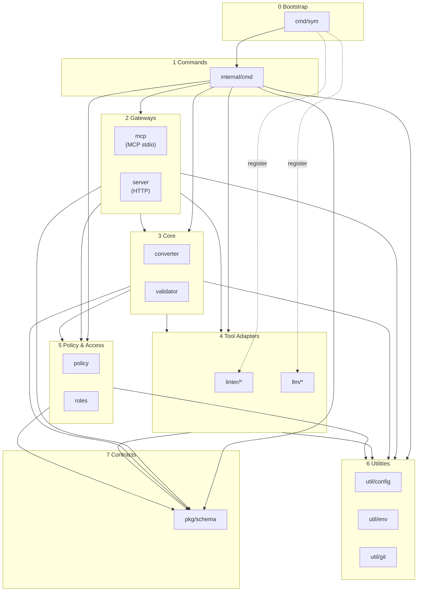

# Architecture

Symphony CLI의 전체 아키텍처와 패키지 의존성 구조를 설명합니다.

## Overview

Symphony는 LLM 기반 코드 컨벤션 검사 도구로, 다음과 같은 핵심 기능을 제공합니다:

- 자연어로 컨벤션 정의
- LLM이 MCP를 통해 필요한 컨벤션만 추출하여 컨텍스트에 포함
- LLM이 MCP를 통해 코드 변경사항에 대한 컨벤션 준수 여부를 검사
- RBAC 기반 접근 제어

## Layer Structure

시스템은 8개의 논리적 계층으로 구성됩니다:

| Layer | Name | Role |
|-------|------|------|
| 0 | Bootstrap | 애플리케이션 진입점, 프로바이더 등록 |
| 1 | Commands | CLI 명령어 구현 |
| 2 | Gateways | 외부 인터페이스 (MCP stdio, HTTP) |
| 3 | Core | 핵심 비즈니스 로직 (변환, 검증) |
| 4 | Tool Adapters | 린터 및 LLM 프로바이더 어댑터 |
| 5 | Policy & Access | 정책 관리 및 접근 제어 |
| 6 | Utilities | 공통 유틸리티 |
| 7 | Contracts | 공유 데이터 스키마 |

## Dependency Diagram

### Simple Version



## Layer Details

### Layer 0: Bootstrap (`cmd/sym`)

애플리케이션 진입점입니다. `main.go`에서 CLI를 실행하고, `bootstrap.go`에서 린터와 LLM 프로바이더를 레지스트리에 등록합니다.

```go
// cmd/sym/bootstrap.go
import (
    _ "github.com/DevSymphony/sym-cli/internal/linter/eslint"
    _ "github.com/DevSymphony/sym-cli/internal/llm/claudecode"
    // ...
)
```

### Layer 1: Commands (`internal/cmd`)

Cobra 프레임워크 기반 CLI 명령어를 구현합니다.

| Command | Description |
|---------|-------------|
| `sym init` | 프로젝트 초기화 |
| `sym validate` | 코드 검증 |
| `sym convert` | 정책 변환 |
| `sym dashboard` | 웹 대시보드 실행 |
| `sym mcp` | MCP 서버 실행 |
| `sym my-role` | 역할 관리 |
| `sym llm status\|test\|setup` | LLM 프로바이더 관리 |

### Layer 2: Gateways

외부 시스템과의 인터페이스를 제공합니다.

#### MCP Server (`internal/mcp`)

AI 코딩 도구(Claude Code, Cursor 등)와 stdio를 통해 통신합니다.

| Tool | Description |
|------|-------------|
| `query_conventions` | 프로젝트 컨벤션 조회 |
| `validate_code` | 코드 변경사항 검증 |

#### HTTP Server (`internal/server`)

웹 대시보드용 REST API를 제공합니다.

| Endpoint | Description |
|----------|-------------|
| `GET /api/policy` | 정책 조회 |
| `POST /api/policy` | 정책 저장 |
| `GET /api/roles` | 역할 목록 조회 |
| `POST /api/select-role` | 역할 선택 |

### Layer 3: Core

핵심 비즈니스 로직을 구현합니다.

#### Converter (`internal/converter`)

UserPolicy(A Schema)를 CodePolicy(B Schema)로 변환합니다.

```
UserPolicy (자연어 규칙)
    |
    v LLM 라우팅
+---------------------------+
| 규칙별 린터 매핑          |
| - ESLint 규칙             |
| - Prettier 설정           |
| - llm-validator fallback  |
+---------------------------+
    |
    v
CodePolicy (정형화된 규칙) + 린터 설정 파일
```

#### Validator (`internal/validator`)

4단계 파이프라인으로 코드를 검증합니다:

1. **RBAC 검사**: 역할 기반 파일 접근 권한 확인
2. **규칙 그룹화**: 엔진별로 규칙 분류
3. **실행 단위 생성**: 린터/LLM 실행 단위 구성
4. **병렬 실행**: 세마포어 기반 동시성 제어

### Layer 4: Tool Adapters

외부 도구와의 통합을 담당합니다.
Registry Pattern을 사용하므로 새로운 도구를 추가할 때 기존 코드 수정 불필요합니다.

#### Linter (`internal/linter/*`)

정적 린팅 도구 어댑터입니다. 각 린터는 `Linter`와 `Converter` 인터페이스를 구현합니다.

| Linter | Language | Purpose |
|--------|----------|---------|
| ESLint | JS/TS | 코드 품질, 스타일 |
| Prettier | JS/TS/JSON/CSS | 코드 포맷팅 |
| Pylint | Python | 코드 품질 |
| TSC | TypeScript | 타입 검사 |
| Checkstyle | Java | 스타일 검사 |
| PMD | Java | 정적 분석 |

#### LLM (`internal/llm/*`)

LLM 프로바이더 어댑터입니다. 각 프로바이더는 `RawProvider` 인터페이스를 구현합니다.

| Provider | Type | Default Model |
|----------|------|---------------|
| claudecode | CLI | sonnet |
| geminicli | CLI | gemini-2.5-flash |
| openaiapi | API | gpt-4o-mini |

### Layer 5: Policy & Access

정책 관리와 접근 제어를 담당합니다.

#### Policy (`internal/policy`)

정책 파일의 로드, 저장, 검증 및 템플릿 관리를 수행합니다.

- `user-policy.json` (A Schema) 관리
- `code-policy.json` (B Schema) 관리
- 내장 템플릿 제공 (React, Vue, Node.js, Python, Go, TypeScript)

#### Roles (`internal/roles`)

RBAC 기반 접근 제어를 제공합니다.

- 역할 정의 관리 (`roles.json`)
- 현재 역할 상태 관리 (`.sym/.env`)
- 파일 접근 권한 검증 (AllowWrite/DenyWrite 패턴)

### Layer 6: Utilities (`internal/util/*`)

공통 유틸리티를 제공합니다.

| Package | Description |
|---------|-------------|
| `util/config` | 프로젝트 설정 (`config.json`) 관리 |
| `util/env` | 환경 변수 파일 (`.env`) 관리 |
| `util/git` | Git 저장소 정보, diff 추출 |

### Layer 7: Contracts (`pkg/schema`)

시스템 전체에서 공유하는 데이터 스키마를 정의합니다.

```
+---------------------------------------------+
|           A Schema (사용자 친화적)          |
|  UserPolicy --+-- UserRBAC --- UserRole     |
|               +-- UserDefaults              |
|               +-- UserRule[]                |
+------------------------+--------------------+
                         |
                converter.Convert()
                         |
                         v
+---------------------------------------------+
|           B Schema (시스템 실행용)          |
|  CodePolicy --+-- PolicyRBAC --- PolicyRole |
|               +-- PolicyRule[]              |
|               +-- EnforceSettings           |
+---------------------------------------------+
```

## Design Principles

### Unidirectional Dependencies

상위 계층은 하위 계층만 의존합니다. 순환 의존성이 없습니다.

```
Bootstrap -> Commands -> Gateways -> Core -> Adapters -> Utilities -> Contracts
```

### Registry Pattern

린터와 LLM 프로바이더는 `init()` 함수에서 전역 레지스트리에 등록됩니다. 이를 통해:

- 새 어댑터 추가 시 기존 코드 수정 불필요
- Bootstrap에서 import만으로 등록 완료
- 런타임에 사용 가능한 도구 동적 조회

### Interface-based Design

핵심 컴포넌트는 인터페이스로 정의되어 테스트 용이성과 확장성을 보장합니다.

```go
// Linter interface
type Linter interface {
    Name() string
    Execute(ctx context.Context, config []byte, files []string) (*ToolOutput, error)
    ParseOutput(output *ToolOutput) ([]Violation, error)
}

// LLM Provider interface
type RawProvider interface {
    Name() string
    ExecuteRaw(ctx context.Context, prompt string, format ResponseFormat) (string, error)
    Close() error
}
```

## References

- [CLI Command Reference](COMMAND.md)
- [pkg/schema README](../pkg/schema/README.md) - Schema definitions
- [internal/linter README](../internal/linter/README.md) - Linter integration guide
- [internal/llm README](../internal/llm/README.md) - LLM provider integration guide
